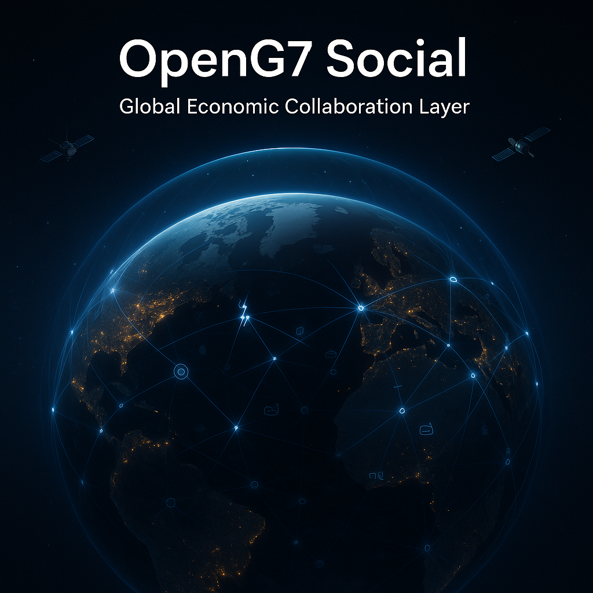

# 💬 OpenG7 – Social

## 🇬🇧 English

**Open-source economic social network for the OpenG7 ecosystem (global)**

🌍 **What it is**  
OpenG7 – Social is an open-source collaboration layer built for **all countries**. It helps governments, organizations, businesses, and communities coordinate around real-world economic inputs and capabilities: **energy (oil, electricity, gas), specialized labour, services, logistics, industrial supply**, and more.  
It enables people to publish **offers / requests**, open **threads**, and turn discussions into **structured signals** that can be connected to OpenG7’s mapping and analysis tools.

🧪 **Status:** Early public project (prototype)

This project is independent from any government or intelligence agency. It is an open, neutral, and ethical initiative focused on resilience, transparency, and cross-border innovation.

---

## 🎯 Why a “social” layer matters

A map shows *capacity*. A social layer shows *coordination*:

- **From discovery → action**: turn signals into structured offers/requests and real connections.
- **Faster response**: coordinate during disruptions, shortages, and urgent needs.
- **Trust-building**: verification, accountability, and moderation reduce noise.
- **Knowledge retention**: discussions become reusable intelligence (without exposing sensitive details).

---

## 🧩 Core concepts

- **Post**: a public signal (offer, request, insight, alert).
- **Thread**: discussion under a post (clarify, propose, negotiate, document).
- **Offer / Request**: structured economic intent (what, where, capacity, constraints).
- **Connection**: a formalized relationship between regions/organizations (optional map integration).
- **Trust**: verification + reputation + moderation to keep the system usable at scale.

---

## ✨ MVP-first features

### Feed & threads
- Public feed by **region / sector / input**
- Threads + replies (full history)
- Tags: country/region, sector, input type, urgency

### Structured intent
- Convert a post → **Offer** or **Request**
- Capacity fields (volume, time window, delivery coverage)
- “Private details” handoff (keep confidential numbers off the public feed)

### Discovery & follow
- Search + filters
- Saved filter modes (ex: “Export-only”, “Import-only”, “All”)
- Follow: regions, sectors, organizations, inputs

### Trust & moderation (non-negotiable)
- Anti-spam protections
- Reporting + moderation queue
- Verified organizations (progressive rollout)
- Audit-friendly history (without exposing sensitive content)

---

## 🧱 Frontend architecture (signal-first)

OpenG7 – Social follows a **100% signal-first** approach:
- Each component owns local state using `signal()`, `computed()`, `effect()`
- NgRx is used globally only when state must be shared, cached, or synchronized

### Suggested Angular structure

- `src/app/social/`
  - `src/app/social/models/` — typed models (Post, Thread, Offer, Request, Org)
  - `src/app/social/data-access/` — API clients, facades, NgRx when needed
  - `src/app/social/ui/` — standalone UI components (signal-first)
  - `src/app/social/feature-feed/` — feed page + filters
  - `src/app/social/feature-thread/` — thread page (post + replies)
  - `src/app/social/feature-compose/` — create post / offer / request
  - `src/app/social/feature-org/` — organization profile + verification

---

## 🧰 Tech stack

- **Angular** `19.2.5` (standalone components)
- **TypeScript** (strict)
- **Yarn**
- **TailwindCSS** `^4.1.10`
- **NgRx** `19.1.0` (global when necessary)
- **@ngx-translate/core** `^16.0.4` + **@ngx-translate/http-loader** `^16.0.1`
- Typed **Reactive Forms**
- SSR-friendly patterns (avoid `window` in shared code paths)

---

## 🗺️ Roadmap (high-level)

1) **MVP**
- feed + threads + filters
- create post + report

2) **Structured offers/requests**
- typed forms
- convert thread → structured request

3) **Map integration**
- attach thread to a potential connection
- turn verified outcomes into map connections

4) **Trust at scale**
- stronger verification, moderation tooling, anti-abuse hardening

---

## 🤝 Contributing

OpenG7 – Social welcomes:
- Angular signal-first contributors
- Backend/API contributors
- UX writers (i18n-ready)
- Moderation & trust design
- Economic domain experts (inputs, logistics, energy, labour)

Recommended repo files:
- `CONTRIBUTING.md`
- `CODE_OF_CONDUCT.md`
- `SECURITY.md`

---

## 🛡️ Safety, privacy, and responsible use

This project is built for collaboration, not surveillance:
- Do not publish confidential contract terms or sensitive pricing
- Prefer capacity + intent + region; keep private details in private channels
- Moderation is essential to resist spam, manipulation, and harassment

---

## 📄 License

Choose a license aligned with the OpenG7 ecosystem (commonly MIT).  
See `LICENSE` for the source of truth.

---

## 🇫🇷 Français

**Réseau social économique open source pour l’écosystème OpenG7 (mondial)**

🌍 **Ce que c’est**  
OpenG7 – Social est une couche de collaboration open source conçue pour **tous les pays**. Elle aide les gouvernements, organisations, entreprises et communautés à se coordonner autour d’intrants et de capacités économiques réelles : **énergie (pétrole, électricité, gaz), main-d’œuvre spécialisée, services, logistique, intrants industriels**, etc.  
Le module permet de publier des **offres / demandes**, d’ouvrir des **fils de discussion**, puis de transformer les échanges en **signaux structurés** connectables aux outils de cartographie et d’analyse d’OpenG7.

🧪 **Statut :** Projet public en démarrage (prototype)

Projet indépendant de tout gouvernement ou agence de renseignement. Initiative ouverte, neutre et éthique — axée sur la résilience, la transparence et l’innovation transfrontalière.

---

## 🎯 Pourquoi une couche “sociale” est utile

Une carte montre la *capacité*. Une couche sociale montre la *coordination* :

- **De la découverte à l’action** : transformer des signaux en offres/demandes structurées et connexions réelles.
- **Réaction rapide** : coordonner pendant les ruptures, pénuries, urgences.
- **Confiance** : vérification, responsabilité, modération → moins de bruit.
- **Mémoire collective** : les échanges deviennent de l’intelligence réutilisable (sans exposer du sensible).

---

## 🧩 Concepts clés

- **Post** : signal public (offre, demande, insight, alerte).
- **Thread** : discussion sous un post (clarifier, proposer, négocier, documenter).
- **Offre / Demande** : intention économique structurée (quoi, où, capacité, contraintes).
- **Connexion** : relation formalisée entre régions/organisations (intégration carte optionnelle).
- **Confiance** : vérification + réputation + modération pour rester utilisable à grande échelle.

---

## ✨ Fonctionnalités (MVP-first)

### Fil d’activité & discussions
- Feed public par **région / secteur / intrant**
- Threads + réponses (historique complet)
- Tags : pays/région, secteur, intrant, urgence

### Intention structurée
- Convertir un post → **Offre** ou **Demande**
- Champs de capacité (volume, fenêtre temporelle, couverture de livraison)
- Passage “détails privés” (ne pas exposer les chiffres sensibles)

### Découverte & suivi
- Recherche + filtres
- Modes de filtres sauvegardés (ex : “Exportation seulement”, “Importation seulement”, “Tous”)
- Suivre : régions, secteurs, organisations, intrants

### Confiance & modération (non négociable)
- Anti-spam
- Signalement + file de modération
- Organisations vérifiées (déploiement progressif)
- Historique compatible avec l’audit (sans divulguer du sensible)

---

## 🧱 Architecture frontend (signal-first)

Approche **100 % signal-first** :
- chaque composant gère son état via `signal()`, `computed()`, `effect()`
- NgRx est utilisé globalement seulement quand l’état doit être partagé, mis en cache ou synchronisé

### Structure Angular suggérée

- `src/app/social/`
  - `src/app/social/models/` — modèles typés (Post, Thread, Offre, Demande, Org)
  - `src/app/social/data-access/` — clients API, facades, NgRx au besoin
  - `src/app/social/ui/` — composants UI standalone (signal-first)
  - `src/app/social/feature-feed/` — page feed + filtres
  - `src/app/social/feature-thread/` — page thread (post + réponses)
  - `src/app/social/feature-compose/` — création post / offre / demande
  - `src/app/social/feature-org/` — profil d’organisation + vérification

---

## 🧰 Stack technologique

- **Angular** `19.2.5` (standalone)
- **TypeScript** (strict)
- **Yarn**
- **TailwindCSS** `^4.1.10`
- **NgRx** `19.1.0` (global quand nécessaire)
- **@ngx-translate/core** `^16.0.4` + **@ngx-translate/http-loader** `^16.0.1`
- Formulaires **réactifs typés**
- Patterns SSR-friendly (éviter `window` dans les chemins partagés)

---

## 🗺️ Feuille de route (haut niveau)

1) **MVP**
- feed + threads + filtres
- création post + signalement

2) **Offres/demandes structurées**
- formulaires typés
- convertir thread → demande structurée

3) **Intégration carte**
- attacher un thread à une connexion potentielle
- convertir les résultats vérifiés en connexions sur la carte

4) **Confiance à grande échelle**
- vérification renforcée, outils de modération, durcissement anti-abus

---

## 🤝 Contribuer

OpenG7 – Social accueille :
- contributeurs Angular signal-first
- contributeurs backend/API
- UX writers (i18n-ready)
- conception modération & confiance
- experts économiques (intrants, logistique, énergie, main-d’œuvre)

Fichiers recommandés :
- `CONTRIBUTING.md`
- `CODE_OF_CONDUCT.md`
- `SECURITY.md`

---

## 🛡️ Sécurité, confidentialité et usage responsable

Projet conçu pour la collaboration, pas la surveillance :
- ne publie pas de termes contractuels confidentiels ou de prix sensibles
- privilégie capacité + intention + région; garde les détails en privé
- la modération est essentielle contre le spam, la manipulation et le harcèlement

---

## 📄 Licence

Choisir une licence cohérente avec l’écosystème OpenG7 (souvent MIT).  
Le fichier `LICENSE` fait foi.
